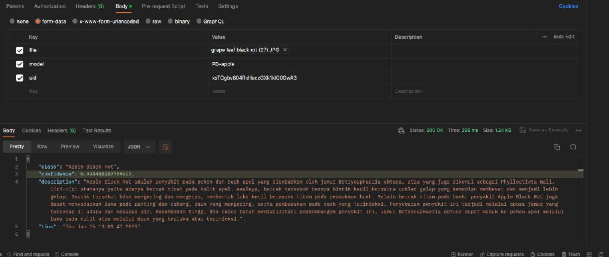

# ML API Service

Untuk menggunakan API ini, berdasarkan form-data yang akan diberikan kepada server yang menghost server ini dengan perintah POST. Form data yang diperlukan terisi berdasarkan filenya terdiri atas:

## File

File, terutama foto digital yang akan digunakan untuk terproses oleh model ML yang telah terbuat. Bentuk file yang sesuai dengan permintaan API berdasarkan pengujian yang kami lakukan adalah dalam bentuk .JPG

## Model

Key ini menunjukkan ML model yang akan digunakan untuk mendeteksi kelainan yang dimiliki tanaman, buah, atau sayuran yang terfoto. Dua huruf pertama dalam isi Key tersebut (PD, FP) akan menunjukkan tipe objek yang ingin terdeteksi. PD (Plant-Diseases) mendeteksi penyakit yang dimiliki oleh tanaman dan beberapa buahan, serta FP (Fruit-Veg-Ripeness) mendeteksi kondisi kematangan berbagai sayuran dan buah-buahan.

Contoh: "PD-Grape" akan mendeteksi penyakit yang dimiliki oleh tanaman anggur. 

## uid

Key ini akan berfungsi sebagai arahan untuk menyimpan riwayat deteksi buahan, penyakit tanaman, dan sayuran yang dilakukan oleh user pada sebuah periode. Isi tersebut sama dengan nama yang diberikan dokumen user yang sama dalam Firebase Auth serta Firestore.

Contoh respons yang berhasil adalah sebagai berikut:

```json
{
    "class" : "Sifat_Terdeteksi",
    "confidence" : "0.7675789",
    "description" : "Deskripsi_untuk_sifat_terdeteksi",
    "time" : "Mon Jun 12 15:24:12 2023"
}
```

